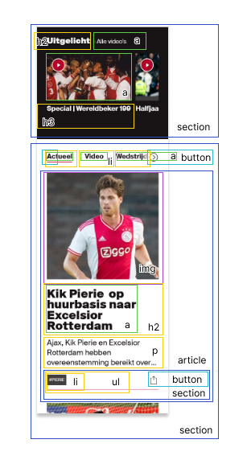

# Procesverslag
Markdown is een simpele manier om HTML te schrijven.  
Markdown cheat cheet: [Hulp bij het schrijven van Markdown](https://github.com/adam-p/markdown-here/wiki/Markdown-Cheatsheet).

Nb. De standaardstructuur en de spartaanse opmaak van de README.md zijn helemaal prima. Het gaat om de inhoud van je procesverslag. Besteedt de tijd voor pracht en praal aan je website.

Nb. Door *open* toe te voegen aan een *details* element kun je deze standaard open zetten. Fijn om dat steeds voor de relevante stuk(ken) te doen.

## Jij

  
uitwerken voor kick-off werkgroep

  ### Auteur:
  Sten Kotten

  #### Je startniveau:
  Blauw. Ik heb op moment van schrijven al bijna 2 jaar geen code meer aangeraakt.

  #### Je focus:
  hier je focus (kies uit responsive óf surface plane)
 

## Je website

  
uitwerken voor kick-off werkgroep

  ### Je opdracht:
  https://www.ajax.nl/
  
  #### Screenshot(s) van de eerste pagina (small screen): 
  hier de naam van de pagina  
  

  #### Screenshot(s) van de tweede pagina (small screen):
  hier de naam van de pagina  
  
 

## Toegankelijkheidstest 1/2 (week 1)

  
uitwerken na test in 1e werkgroep

  ### Bevindingen
  Lijst met je bevindingen die in de test naar voren kwamen:

  #### Screenreader
  Hier korte omschrijving (met indien nodig afbeeldingen)
Er wordt verteld dat er een tag is, maar niet wat voor tag het is (wat er in staat)
Er zit een dood eind voor de footer.
Populaire items op de homepage hebben geen alt-text. Niet alles heeft een alt-text.
Elementen die er hetzelfde uitzien worden anders gecategoriseerd (link,kopjes), waardoor er een onlogische volgorde wordt nagelopen.
  
  Hier een omschrijving van hoe het opgelost kan worden (met indien nodig afbeeldingen)
Semantisch correcte code waardoor er een logische volgorde wordt nagelopen. 
Alt-teksten gebruiken.

  #### Muis en Toetsenbord 
 ##### Hier korte omschrijving (met indien nodig afbeeldingen)
Bij besturing met toetsenbord wordt de hoofdnavigatie overgeslagen. 
Bij gebruik van tab om te navigeren is het onduidelijk waar de gebruiker zich op de website bevindt. Op sommige onderdelen (zoals producten, is wel een blauwe outline.
Controls met de pijltjes op het toetsenbord werkt niet, alleen met tab.
Hovers op de buttons zijn wel aanwezig, maar er is te weinig contrast om het merkbaar te maken. (zwart → donkergrijs) 
Active onder menu bij section 3 is er wel, maar in de hoofdnavigatie niet.
  
 ##### Hier een omschrijving van hoe het opgelost kan worden (met indien nodig afbeeldingen)
Semantisch correcte code.
Hover met meer contrast.

  #### Motoriek (shocks, elastiekjes)
  ##### Hier korte omschrijving (met indien nodig afbeeldingen)
Elestiekjes: Bij het typen zorgt het voor problemen. Bij het bewegen van muis moet de gebruiker een grotere beweging maken. Verder ging navigeren nog goed, alleen iets langzamer dan normaal.
Spasmes: Typen is moeilijk, veel onbedoeld typen. Kan muis niet stil houden.
Concentratie: De focus van de gebruiker ligt vooral op de baloon. Ik vond het moeilijk om uberhaupt de website te navigeren, laat staan een taak voltooien.
  
  ##### Hier een omschrijving van hoe het opgelost kan worden (met indien nodig afbeeldingen)
Grote navigatie elementen.

  #### Visueel (brillen, contrast, kleurenblind, dark/light). 
  ##### Hier korte omschrijving (met indien nodig afbeeldingen)
Blur: Witte knop zonder border moeilijk te zien. Grote tekst is nog wel te lezen, maar kleine tekst niet.
Hemifield loss: Hoofd bewegen om hele scherm te zien. Meer afstand nemen om een grotere viewport te ervaren.
Staar: Het centrale zicht is erg slecht, daarom heen wel prima. 
Diabetic Eye Desease: Je ziet alleen een paar vlekken. Typen is moeilijk, omdat de gebruiker hun blik constant verplaatst. 
Low contrast: hovers niet meer te zien. Vooral bij witte knoppen, zwarte tekst.
Er is geen dark mode.
  
  ##### Hier een omschrijving van hoe het opgelost kan worden (met indien nodig afbeeldingen)
Dark mode toevoegen.
Opvallende knoppen.

## Breakdownschets (week 1)

  
uitwerken na afloop 2e werkgroep

  ### de hele pagina: 
  

  ### dynamisch deel (bijv menu): 
  

  ### wellicht nog een dynamisch deel: 
  

  ### wellicht nog een dynamisch deel: 
  

## Voortgang 1 (week 2)

  
uitwerken voor 1e voortgang

  ### Stand van zaken
  hier dit ging goed & dit was lastig (neem ook screenshots op van delen van je website en code)
  Ik ben nog steeds bezig met het html skelet.

  ### Agenda voor meeting
  samen met je groepje opstellen

  | student 1      | student 2          | student 3    | student 4        |
  | ---            | ---                | ---          | ---              |
  | dit bespreken  | en dit             | en ik dit    | en dan ik dat    |
  | en dat ook nog | dit als er tijd is | nog een punt | dit wil ik zeker |
  | ...            | ...                | ...          | ...              |

  ### Verslag van meeting
  hier na afloop snel de uitkomsten van de meeting vastleggen

  - punt 1
  - punt 2
  - nog een punt
  - ...

## Voortgang 2 (week 3)

  
uitwerken voor 2e voortgang

  ### Stand van zaken
  hier dit ging goed & dit was lastig (neem ook screenshots op van delen van je website en code)

  ### Agenda voor meeting
  samen met je groepje opstellen

  | student 1      | student 2          | student 3    | student 4        |
  | ---            | ---                | ---          | ---              |
  | dit bespreken  | en dit             | en ik dit    | en dan ik dat    |
  | en dat ook nog | dit als er tijd is | nog een punt | dit wil ik zeker |
  | ...            | ...                | ...          | ...              |

  ### Verslag van meeting
  hier na afloop snel de uitkomsten van de meeting vastleggen

  - punt 1
  - punt 2
  - nog een punt
- ...

## Toegankelijkheidstest 2/2 (week 4)

  
uitwerken na test in 8e werkgroep

  ### Bevindingen
  Lijst met je bevindingen die in de test naar voren kwamen (geef ook aan wat er verbeterd is):

  #### Screenreader
  Hier korte omschrijving (met indien nodig afbeeldingen)

  Hier een omschrijving van hoe het opgelost kan worden (met indien nodig afbeeldingen)

  #### Muis en Toetsenbord 
  Hier korte omschrijving (met indien nodig afbeeldingen)

  Hier een omschrijving van hoe het opgelost kan worden (met indien nodig afbeeldingen)

  #### Motoriek (shocks, elastiekjes)
  Hier korte omschrijving (met indien nodig afbeeldingen)

  Hier een omschrijving van hoe het opgelost kan worden (met indien nodig afbeeldingen)

  #### Visueel (brillen, contrast, kleurenblind, dark/light). 
  Hier korte omschrijving (met indien nodig afbeeldingen)

  Hier een omschrijving van hoe het opgelost kan worden (met indien nodig afbeeldingen)

## Voortgang 3 (week 4)

  
uitwerken voor 3e voortgang

  ### Stand van zaken
  hier dit ging goed & dit was lastig (neem ook screenshots op van delen van je website en code)

  ### Agenda voor meeting
  samen met je groepje opstellen

  | student 1      | student 2          | student 3    | student 4        |
  | ---            | ---                | ---          | ---              |
  | dit bespreken  | en dit             | en ik dit    | en dan ik dat    |
  | en dat ook nog | dit als er tijd is | nog een punt | dit wil ik zeker |
  | ...            | ...                | ...          | ...              |

  ### Verslag van meeting
  hier na afloop snel de uitkomsten van de meeting vastleggen

  - punt 1
  - punt 2
  - in de nav geen ul in een ul
  - in de footer ul gebruiken ipv sections
  - hele article klikbaar maken ipv alleen de h2
  - img maken ipv figure
  - a in artikel zetten
  - h2 altijd bovenaan in html
  - stackedit.io
  - alleen navigatie in de nav
  
  
  - ...

## Eindgesprek (week 5)

  
uitwerken voor eindgesprek

  ### Je uitkomst - karakteristiek screenshots:
  

  ### Dit ging goed/Heb ik geleerd: 
  Korte omschrijving met plaatjes

  

  ### Dit was lastig/Is niet gelukt:
  Korte omschrijving met plaatjes

  

## Bronnenlijst

  
continu bijhouden terwijl je werkt

  Nb. Wees specifiek ('css-tricks' als bron is bijv. niet specifiek genoeg).

  1. bron 1
  2. bron 2
  3. ...

